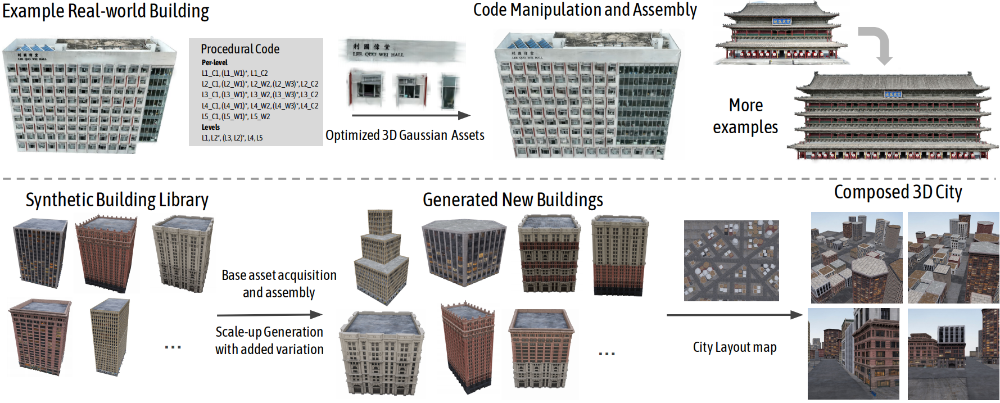

# ProcGS

**Proc-GS: Procedural Building Generation for City Assembly with 3D Gaussians.**

[Yixuan Li](https://yixuanli98.github.io/), [Xingjian Ran](https://scholar.google.com/citations?user=8AubXI4AAAAJ&hl=zh-CN), [Linning Xu](https://eveneveno.github.io/lnxu/), [Tao Lu](https://inspirelt.github.io/), [Mulin Yu](https://mulinyu.github.io/), [Zhenzhi Wang](https://zhenzhiwang.github.io/), [Yuanbo Xiangli](https://kam1107.github.io/), [Dahua Lin](http://dahua.site/), [Bo Dai](https://daibo.info/)

The Chinese University of Hong Kong, Shanghai AI Laboratory, Brown University, Cornell University, The University of Hong Kong

[[`Paper`]()] 
[[`Project Page`](https://city-super.github.io/procgs/)]

Code coming soon ...